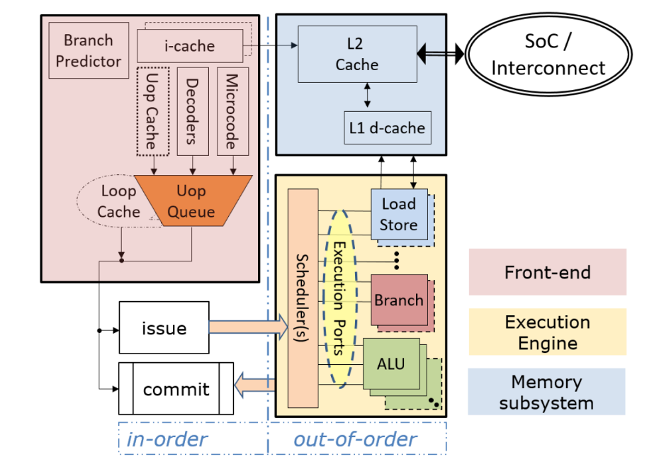
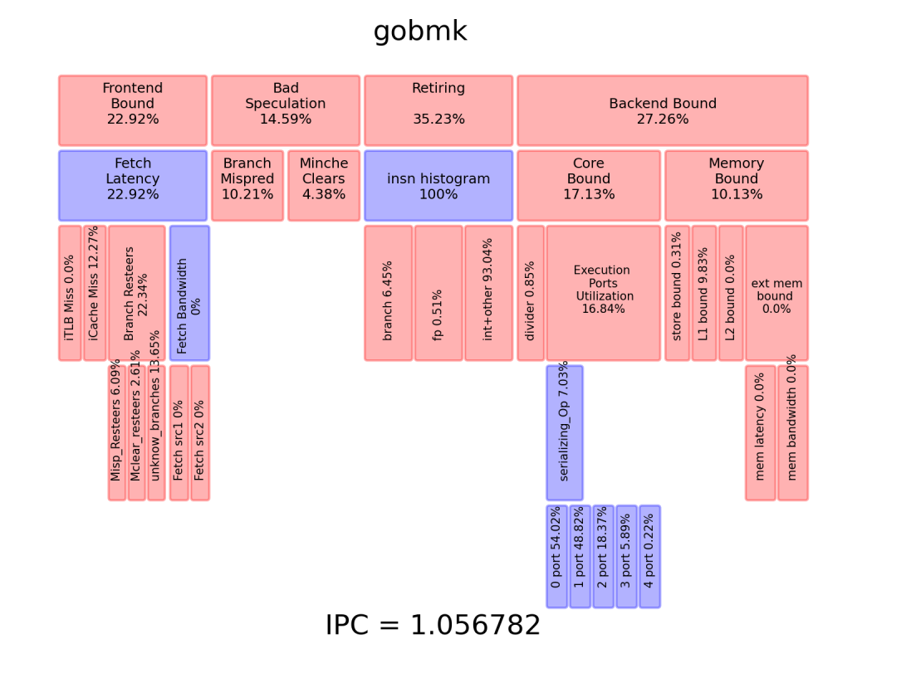

# TMAM understanding

## frontend-bound

## bad-speculation

## retired  

## backend bound
  - memory-bound
  - core-bound

## reference

[A Top-Down method for performance analysis and counters architecture](https://www.researchgate.net/publication/269302126_A_Top-Down_method_for_performance_analysis_and_counters_architecture)
[perfmon-events](https://perfmon-events.intel.com/)
[TMA_Metrics.](https://download.01.org/perfmon/TMA_Metrics.xlsx)
[Top-down Microarchitecture Analysis](http://www.cs.technion.ac.il/~erangi/TMA_using_Linux_perf__Ahmad_Yasin.pdf)
[A Top-Down Method for Performance Analysis and Counters Architecture](https://pdfs.semanticscholar.org/b5e0/1ab1baa6640a39edfa06d556fabd882cdf64.pdf)

[riscv-boom perfMon branch](https://github.com/KingFrige/riscv-boom/blob/perfMon/src/main/scala/exu/core.scala#L476)
