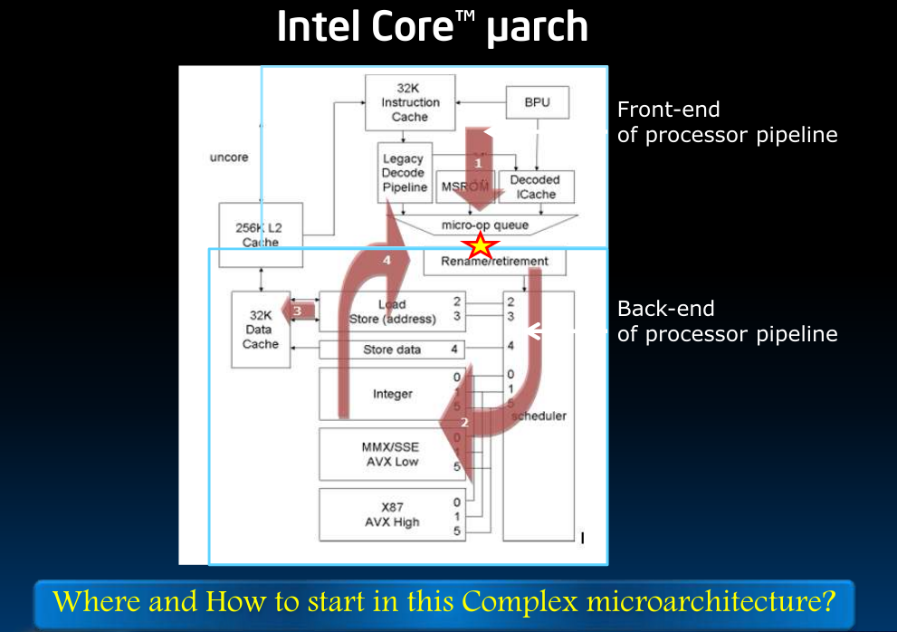
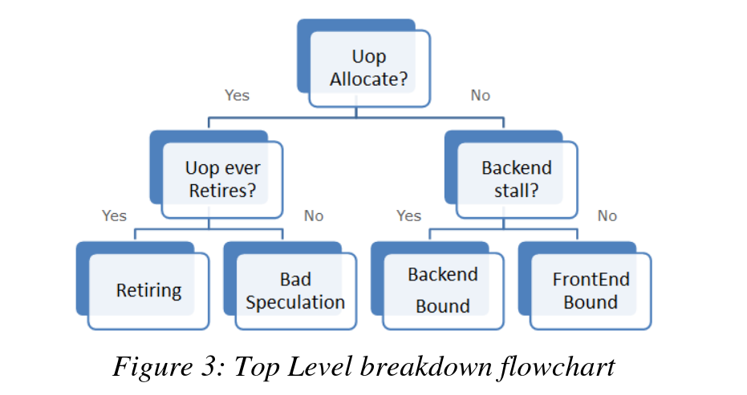

# TMAM understanding

## o3 cpu breakdown

以 `ifetch buffer` 为分界点，可以将o3处理器分成两段

第一部分没有分配 backend 资源(rob entry, physical register, issue slots, exu, load buffer, store buffer...)

第二部分将被分配占有 backend 资源

继续向下分解

第二部分（占有 backend 资源）可以分解为 `retiring` 和 `bad specculation`

第一部分（没有分配 backend 资源）可以分解为 `Backend Bound` 和 ` FrontEnd Bound`

|  top Level Breakdown  | description |
| --------------------- | ----------- |
| retiring              | 占有 backend 资源，并顺利提交的slots |
| bad specculation      | 占有 backend 资源，但没有完成提交，相当于浪费了 backend 资源的slots |
| Backend Bound         | 没有占有 backend 资源，造成后端阻塞的，即来源于后端产生的bubbles |
| FrontEnd Bound        | 没有占有 backend 资源，也没有造成后端阻塞的， 即来源于分割点（ifetch buffer）统计到的 bubbles |

## o3 cpu buffer

在o3处理器中，为达到解耦依赖提高并行的目的，系统中不同阶段被 `buffer` 分隔开

严格上，两个相关的buffer之间就是一条pipeline， `buffer` 的存在将 `pipeline` 分割成了多个更小的pipeline

在o3处理器中，我们需要密切关注 `buffer` 的空满状态及响应 pipeline 的填充情况（pipeling满负荷/pipeline空置/pipeline不空）

|  o3 pipeline buffer   | description                                                            |  buffer empty | buffer full   |
| --------------------- | ---------------------------------------------------------------------- | ------------- | ------------- |
| ifetch buffer         | 分割frontend/backend，是否占用 backend 资源                            | 供不应求，可能造成后端没有指令执行 | 阻塞FrontEnd |
| issue slots           | 乱序的分割点，o3处理器能根据exu资源及指令依赖状态乱序发送到exu单元执行 | 后端资源闲置  | 阻塞FrontEnd |
| rob entry             | 维护顺序的指令信息，writeBack阶段的信息可以唤醒指令是否执行完成        | 后端资源闲置  | 阻塞dispatch |
| load buffer           | 维护load命令队列                                                       | 资源闲置      | 阻塞dispatch |
| store buffer          | 维护store命令队列                                                      | 资源闲置      | 阻塞dispatch |

## o3 cpu pipeline stall

please reference [riscv/boom](https://github.com/riscv-boom/riscv-boom/blob/master/src/main/scala/exu/core.scala#L689))

|  stall events            | description |
| ------------------------ | ----------- |
| rob not ready            |  |
| load queue full          |  |
| store queue full         |  |
| reaname stall            |  |
| wait for empty pipeline  |  |
| wait for rocc            |  |
| brupdate resource stall  |  |
| brupdate mispredict      |  |
| ifu redirect flush       |  |

## Top Level breakdown event

- intel perfMon reference [TMA_Metrics](https://download.01.org/perfmon/TMA_Metrics.xlsx) 
- events description reference [perfmon-events](https://perfmon-events.intel.com/)
- [code reference](https://github.com/KingFrige/riscv-boom/blob/perfMon/src/main/scala/exu/core.scala#L510)

### frontend-bound

### bad-speculation

### retired  

### backend bound
  - memory-bound
  - core-bound

## reference

[A Top-Down method for performance analysis and counters architecture](https://www.researchgate.net/publication/269302126_A_Top-Down_method_for_performance_analysis_and_counters_architecture)

[perfmon-events](https://perfmon-events.intel.com/)

[Top-down Microarchitecture Analysis](http://www.cs.technion.ac.il/~erangi/TMA_using_Linux_perf__Ahmad_Yasin.pdf)

[A Top-Down Method for Performance Analysis and Counters Architecture](https://pdfs.semanticscholar.org/b5e0/1ab1baa6640a39edfa06d556fabd882cdf64.pdf)

[Top-Down performance analysis methodology](https://easyperf.net/blog/2019/02/09/Top-Down-performance-analysis-methodology)

[riscv-boom perfMon branch](https://github.com/KingFrige/riscv-boom/blob/perfMon/src/main/scala/exu/core.scala#L476)

[riscv/boom](https://github.com/riscv-boom/riscv-boom)

