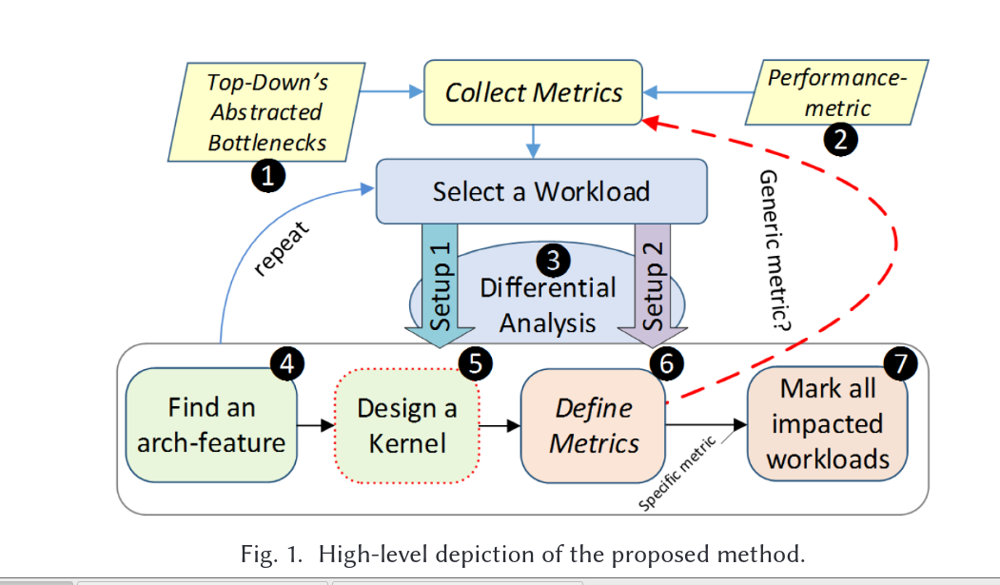

# cpu PPA balance flow

## [workload-analysis](workload-analysis.md)

## [metric-specify-and-microArchtecture-selection](metric-specify-and-microArchtecture-selection.md)

## [TMAM-understanding](TMAM-understanding.md)

## [o3-cpu-micro-Archtecture-analysis.](o3-cpu-micro-Archtecture-analysis.md)

## [chipyard-spec2006-data-collection](chipyard-spec2006-data-collection.md)

## [chipyard-vlsi-flow](chipyard-vlsi-flow.md)

## reference

[Metric-Guided Method](https://www.researchgate.net/publication/338028324_A_Metric-Guided_Method_for_Discovering_Impactful_Features_and_Architectural_Insights_for_Skylake-Based_Processors)
