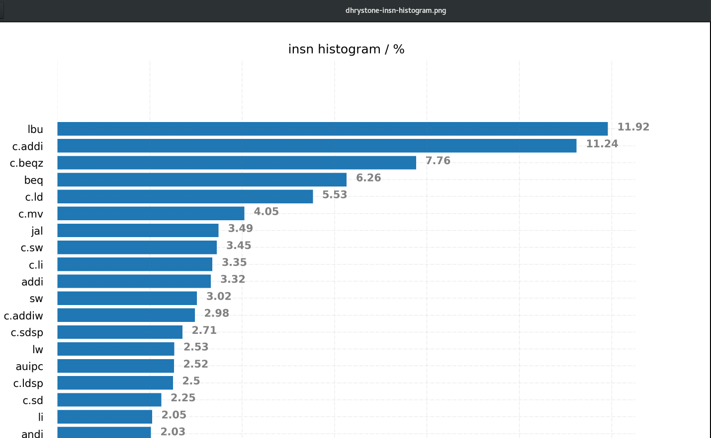

# workload analysis  

use dhrystone as demo

## code understand

[benchmarks/dhrystone](https://github.com/riscv-software-src/riscv-tests/blob/master/benchmarks/dhrystone/dhrystone.h#L225)

- numbers of function 
- data structure
- function call, eg.[GNU cflow](http://www.gnu.org/software/cflow/) / [GNU gprof](https://sourceware.org/binutils/docs/gprof/)
- code Locality

## compile analysis

- Compiler optimization options & compare
- [llvm-mca - LLVM Machine Code Analyzer](https://llvm.org/docs/CommandGuide/llvm-mca.html)
- [LLVM-MCA: docs](http://home.ustc.edu.cn/~shaojiemike/posts/llvm-mca)


## trace log analysis

### spike trace log

- [instruction info](https://github.com/KingFrige/spike-log-analyze/tree/main)

  * 编译[spike](https://github.com/riscv-software-src/riscv-isa-sim)时打开 `--log-commits` 功能
  * 使用spike执行相应的[benchmark](https://github.com/KingFrige/riscv-perf-demo/tree/main/benchmarks)生成commits log
  * 使用 [spike-log-analyze](https://github.com/KingFrige/spike-log-analyze/tree/main) 生成指令直方图

```
$ spike -l --log=dhrystone.riscv.spike.log ./dhrystone.riscv

$ ./plot-insn-histgram.py --path ./demo/dhrystone.riscv.spike.log
```



### code locality analyze

### code branch analyze


## performance sim

- gem5  

> [Understanding gem5 statistics and output](http://learning.gem5.org/book/part1/gem5_stats.html)

- vcs/verilator sim

